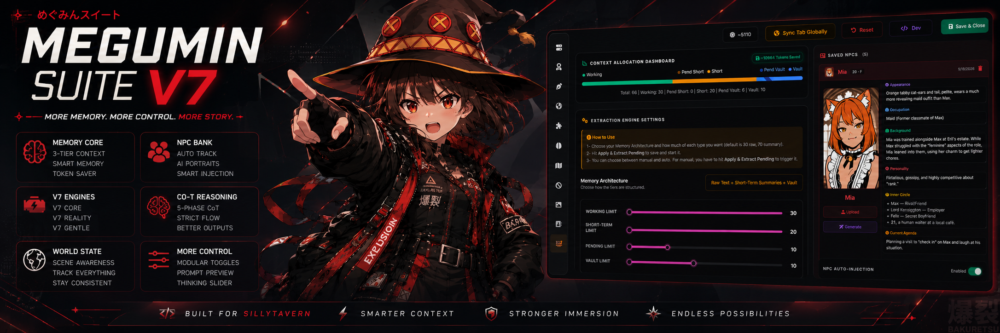

# Megumin Suite for Lumiverse



Megumin Suite is a Lumiverse Spindle extension that ports the original Megumin Suite workflow into Lumiverse. It keeps the wand float widget and the original in-app Megumin UI while using Lumiverse-native storage, interceptors, quiet generations, image generation, and presets under the hood.

## What It Includes

- Core Engines, Persona & Toggles, Writing Style, Global Settings, Add-ons & Blocks, Chain of Thought, Story Planner, Dynamic Ban List, Image Generation, NPCs Bank, Memory Core, and Dev Engine Builder.
- Original Megumin prompt assembly ported into the Lumiverse backend interceptor.
- Native Lumiverse preset discovery for user-imported Megumin Engine, Megumin Image, Megumin Suite V7 DS4, and Megumin Suite V7 Gemini presets.
- Three-tier Memory Core with prompt pruning and TF-IDF retrieval.
- NPC dossier extraction, portrait prompt generation, and prompt injection.
- ComfyUI-style image settings backed by Lumiverse image generation APIs.

## Presets

The extension does not install, copy, or recreate the old runtime preset folder. Import the Megumin presets and their regex scripts into Lumiverse yourself; Megumin Suite discovers those uploaded presets by name and uses their IDs for preset-backed utility generations.

Use the UI preset modes when you want utility generations to route through the Megumin Engine or Megumin Image preset. Direct API Call remains available for the faster path.

## Development

```powershell
bun install
bun run check
```

`bun run check` runs TypeScript, unit tests, and the frontend/backend build.

## Lumiverse Manifest

The Spindle identifier is `megumin_suite`. Required permissions are declared in `spindle.json`, including generation, interceptor, UI panels, image generation, presets, and memories.

## Credits

Original Megumin Suite by KazumaONIISAN. Lumiverse port maintained in this repository.
